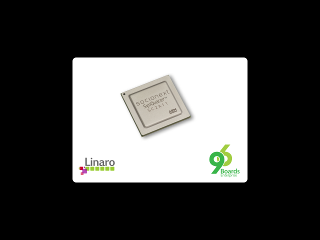
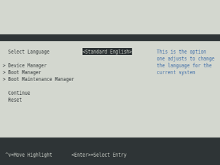

# Getting Started

Your Developerbox, also known as the SynQuacer™ E-Series,
is a desktop computer for developers compliant with the 96Boards
Enterprise Edition specification. Built around a single
[SC2A11](https://www.socionext.com/en/products/assp/SynQuacer/), the
Developerbox has 24 ARM® Cortex-A53 cores.

## Setup - What you will need

**Basic kit includes**

 * Developerbox
   - Motherboard, with SC2A11 and heatsink pre-installed
   - 4GB DDR4-2400 UDIMM
   - 1TB hard disc with SATA cabling
   - Case, I/O backplate and type A (US) power cord
   - GeForce GT-710 Graphics card

**Required Addons**

 * USB Keyboard and Mouse
 * Monitor and HDMI Cable
 * [Optional] Power cord suited to your locality

***

# Starting the board for the first time

The Developerbox ships with system firmware pre-installed in the NOR
FLASH, so once assembled and powered up the board will display the
UEFI splash screen.

The system firmware is based on EDK2 and provides a implementation of
[UEFI](http://www.uefi.org/) just like a modern PC. Also like a modern
PC it implements a menu system to allow settings to be changes and to
allow you to boot in different ways. Developerbox can boot from SATA,
USB or over the network.

If you have a preferred OS now is the time to find out if it is
available in the [Downloads](../downloads/) section. Once you have
an ISO image copied to a stick then, if you can connected it to and
restart your Developerbox, then you should find it in the `Boot Manager`
menu.

If you have a simple home network (or a very relaxed corporate one) then
it is possible to install the [Enterprise Reference
Platform](https://platforms.linaro.org/documentation/Reference-Platform/Platforms/Enterprise/README.md/)
directly from within the EDK2 menu system. The Enterprise Reference
Platform is intended to be used as a reference for component validation
and, among other things, pairs Debian Stretch with a more recent kernel
that comes with full Developerbox support.

   

***

# Hints and tips

## EDK2/UEFI

 * If the graphics card is disconnected the EDK2 and grub menus will be
   displayed on the debug serial port instead. The debug serial port is
   accessed using the micro-USB connector behind the I/O back panel. If
   the menus do not show correctly on the serial port try using
   `screen` or `picocom` instead of minicom and ensure the terminal
   emulator window is at least 80x25 characters

 * The default boot timeout is quite long. It can be shortened by setting
   the appropriate EFI variable:

   `efibootmgr -t <seconds>`

## Debian

 * If you have a couple of x86_64 binaries that you just cannot do
   without (the [hikey960 recovery
   tools](https://github.com/96boards-hikey/tools-images-hikey960) for
   example) then you may be able to run them using QEMU user-mode
   emulator. See https://wiki.debian.org/QemuUserEmulation for more
   details; the instructions have been tested on Developerbox, just
   replace armhf with x86_64.

 * The ARM® Cortex-A53 cores found in Developerbox include support for
   the AArch32 instruction set, allowing armhf binaries to be run
   natively. You will need a suitable C libary and may also need to
   use the package manager to install additional libraries too. The
   add support for `armhf` and install the C library try:

   `dpkg --add-architecture armhf && apt update && apt install libc6:armhf`.

***

## Whats Next?

If you are already familiar with the Developerbox and would like to change out the stock operating system, please proceed to one of the following pages:

- [Downloads page](../downloads/): This page lists all Linaro and 3rd party operating systems available for the Developerbox
- [Support](../support/)
   - From bug reports and current issues, to forum access and other useful resources, we want to help you find answers

Back to the [Developerbox documentation home page](../)

***
